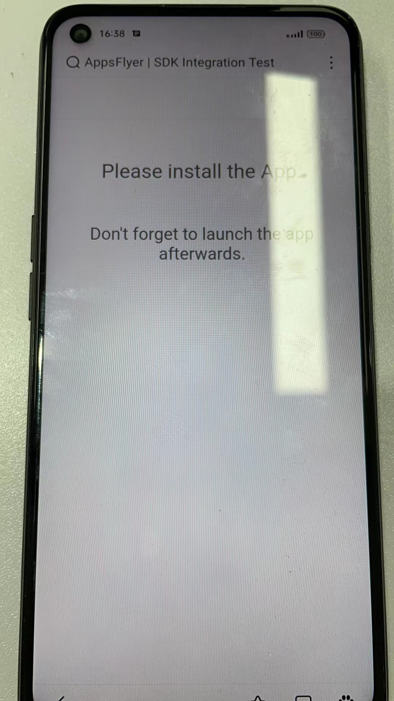

### 1、进入AF后台
[https://hq1.appsflyer.com/apps/myapps ]( )

### 2、选择对应的App

### 3、选择Run test

### 4、添加测试设备

* 添加测试设备步骤

* 关于设备AID获取

> 先安装App，在日志中搜索advertising_id，找到对应的值。
### 5、选择测试设备并测试

* 当扫码二维码打开的链接页面如下图所示时，卸载前面为获取advertising_id安装的App，再次重装应用。

### 6、测试结果

* 正常情况下，AF后台页面大约几秒后会变成如上图所示：
此时App应正常进入B面游戏，并且在后台能看到相应的安装数据。

* 同时不通过这种方式安装的App只能进入A面。