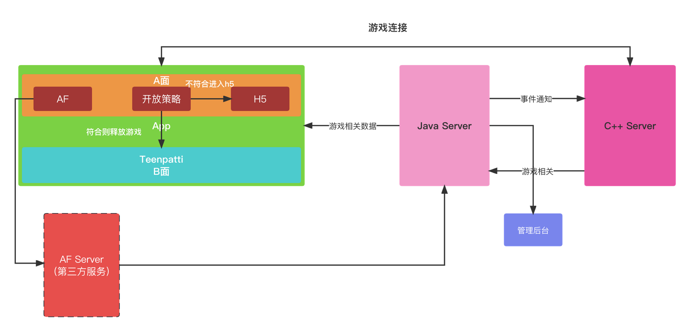

### 1、Teenpatti项目基础架构图

> 通过此图希望兄弟们都对咱们的项目有一个大致的了解。
### 2、研发相关

* 解决AF渠道统计问题（谢、罗）
* Cocos换肤（陈、谢）
* 开放策略library升级（谢）
* C端游戏策略（罗）
* C端游戏核心逻辑摸索（罗）
> > 为日后游戏调优做好准备

### 3、测试相关（祖神）
测试模式：App全量测试

* AF测试
1、App是否上报了相关数据
2、管理后台是否能追踪到相关数据
3、自然量、非自然量进入游戏相关逻辑
* Cocos换肤
1、换肤是否全部替换到位
2、换肤导致的bug，如：按钮失效、控制比例失调等
* App全流程走通
* 管理后台测试
> 时间紧、任务重，测试同学辛苦了

### 4、准备工作

* AF新建新包（完成）
* 马甲包资源（待完成）
* 马甲包工程（70%进度）
* 后台tp2渠道相关配置（待完成）
* UI设计新的logo、启动页
